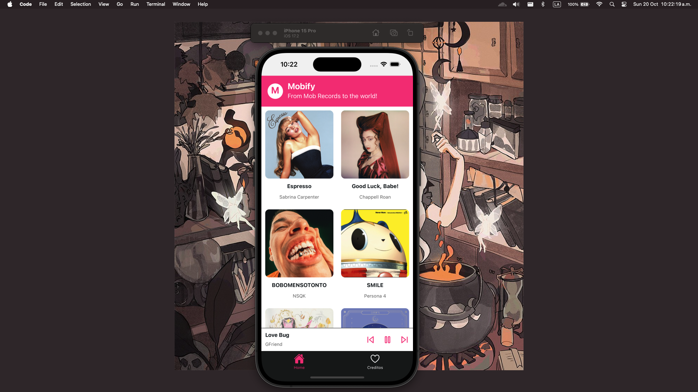

# Mobify 
## Not-A-Spotify-fork. From Mob Records to the world
### Integración de Seguridad Informática en Redes y Sistemas de Software

**Tarea: Multimedia (Imágenes y Sonido)**



Prof. Arturo Javier Lopez

Andrés Martínez - A00227463

**Completely functional on `iOS`**

> It used to be completely functional on web and iOS, due to the nature of the project requiring the use of local storage through SQlite, we migrated from supabase to expo-sqlite which does not support SQLite : )

To test either of those, use the following command 

```npm run ios```
